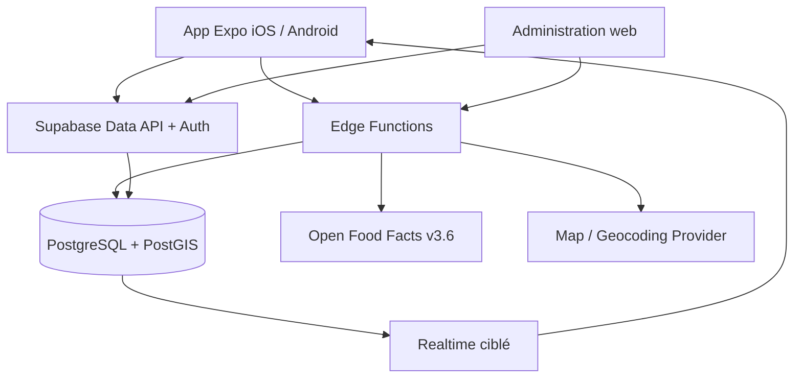
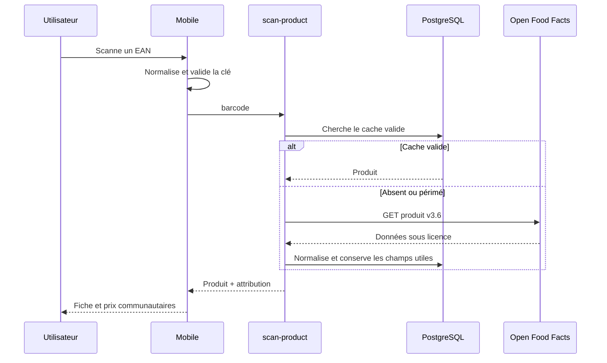

# Architecture du MVP

## Hypothèses

- Zone initiale : France métropolitaine et La Réunion, devise EUR, unités métriques.
- Les prix sont communautaires, non officiels et non garantis.
- Open Food Facts est l’unique fournisseur produit actif du MVP.
- La géolocalisation est facultative et n’est pas conservée comme historique de déplacement.
- Les calculs de points, le risque et la modération sont côté serveur.
- L’application reste utilisable sans compte pour la consultation.

## Vue générale

Le mobile et l’administration ne connaissent que la clé publique. Les fonctions avec privilèges contrôlés gèrent la récupération externe, le scoring, les points, le risque et les actions sensibles. RLS reste la dernière barrière pour chaque table exposée.

## Flux de scan

## Frontières

- `packages/domain` : fonctions pures (EAN, prix unitaire, confiance, niveaux).
- `packages/validation` : contrats d’entrée client ; le serveur revalide indépendamment.
- `apps/mobile/src/lib/api.ts` : façade remplaçable entre démo et Supabase.
- Edge Functions : adaptateurs externes, rate limiting, audit et secrets.
- PostgreSQL : contraintes fortes, calculs sensibles, RLS, historique.

## Hors ligne

Le store Zustand maintient les éléments récents et une file locale. L’implémentation de production doit persister cette file dans SQLite, utiliser un identifiant d’idempotence, afficher `en attente / synchronisée / rejetée / à corriger` et ne créer aucun point avant confirmation serveur.

## Observabilité

- Journal JSON structuré côté fonctions.
- Abstraction prévue pour Sentry.
- Événements produit désactivés sans consentement ; aucune donnée de localisation précise.
- Alertes : taux d’erreur des fonctions, latence p95, erreurs RLS, source désactivée, hausse de quarantaine.
